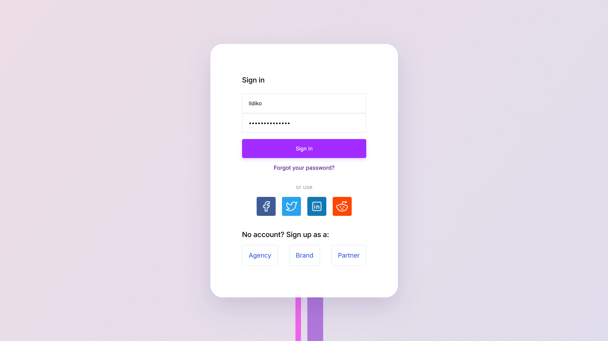

# Página de Login

Este projeto é uma interface de página de login moderna e responsiva, desenvolvida com HTML e CSS. Ele simula um layout de autenticação com campos de e-mail e senha, botão de login e ícones de redes sociais.

## 💻 Tecnologias Utilizadas

- HTML5
- CSS3

## 🧩 Funcionalidades

- Layout com background personalizado
- Formulário com campos de entrada para e-mail e senha
- Ícones de redes sociais para login alternativo
- Estilo moderno e responsivo

## 📷 Preview

## 🚀 Como Executar

1. Faça o download ou clone este repositório.
2. Abra o arquivo `index.html` em seu navegador.

## 📄 Licença

Este projeto é livre para estudos e modificações.